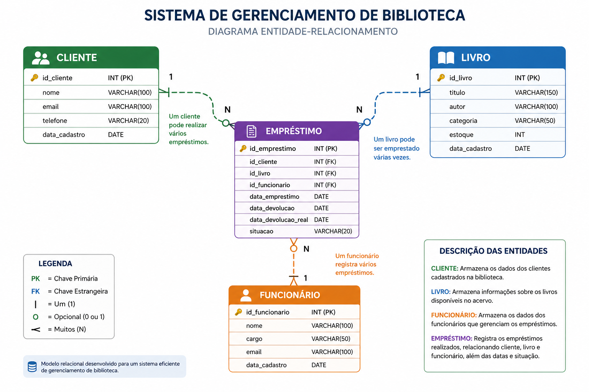

Aqui está um **README profissional**, bem estruturado e pronto para GitHub, baseado no seu contexto:

---

# 📚 Sistema de Gerenciamento de Biblioteca

## 📌 Descrição do Projeto

Este projeto tem como objetivo desenvolver um sistema de gerenciamento eficiente para bibliotecas, permitindo o controle completo de:

* 📖 Livros
* 🔄 Empréstimos
* 👥 Clientes
* 🧑‍💼 Funcionários

A solução propõe a implementação de um banco de dados robusto, capaz de armazenar, consultar e gerenciar informações de forma segura e eficiente, além de possibilitar a geração de relatórios relevantes para apoio à tomada de decisão.

---

## 🎯 Objetivos

* Centralizar o controle de dados da biblioteca
* Facilitar o gerenciamento de empréstimos
* Melhorar o acompanhamento de clientes e funcionários
* Garantir integridade e organização das informações
* Permitir consultas rápidas e geração de relatórios

---

## 🏗️ Diagrama do Banco de Dados

<p align="center">
  
</p>

## 📌 Arquitetura do Sistema

Este sistema utiliza um modelo relacional com foco em integridade e escalabilidade.
O diagrama acima representa as entidades principais e seus relacionamentos.


## 🏗️ Estrutura do Sistema

O sistema é baseado em um modelo relacional, contendo as principais entidades:

* **Cliente** → Usuários da biblioteca
* **Livro** → Acervo disponível
* **Empréstimo** → Registro de retirada e devolução
* **Funcionário** → Responsáveis pelo sistema

---

## 🗄️ Modelagem do Banco de Dados (Exemplo)

```sql
CREATE TABLE cliente (
    id_cliente INT PRIMARY KEY AUTO_INCREMENT,
    nome VARCHAR(100),
    email VARCHAR(100),
    telefone VARCHAR(20)
);

CREATE TABLE funcionario (
    id_funcionario INT PRIMARY KEY AUTO_INCREMENT,
    nome VARCHAR(100),
    cargo VARCHAR(50)
);

CREATE TABLE livro (
    id_livro INT PRIMARY KEY AUTO_INCREMENT,
    titulo VARCHAR(150),
    autor VARCHAR(100),
    categoria VARCHAR(50),
    estoque INT
);

CREATE TABLE emprestimo (
    id_emprestimo INT PRIMARY KEY AUTO_INCREMENT,
    id_cliente INT,
    id_livro INT,
    id_funcionario INT,
    data_emprestimo DATE,
    data_devolucao DATE,
    FOREIGN KEY (id_cliente) REFERENCES cliente(id_cliente),
    FOREIGN KEY (id_livro) REFERENCES livro(id_livro),
    FOREIGN KEY (id_funcionario) REFERENCES funcionario(id_funcionario)
);
```

---

## ⚙️ Funcionalidades

✔ Cadastro de clientes
✔ Cadastro de livros
✔ Controle de estoque
✔ Registro de empréstimos e devoluções
✔ Relatórios de uso da biblioteca
✔ Consulta de dados de forma rápida

---

## 📊 Exemplos de Consultas

```sql
-- Listar todos os livros
SELECT * FROM livro;

-- Empréstimos ativos
SELECT * FROM emprestimo
WHERE data_devolucao IS NULL;

-- Livros mais emprestados
SELECT id_livro, COUNT(*) AS total
FROM emprestimo
GROUP BY id_livro
ORDER BY total DESC;
```

---

## 🚀 Tecnologias Utilizadas

* 🐬 MySQL (Banco de Dados)
* 💻 SQL
* 🧠 Modelagem de Dados

---

## 📈 Possíveis Melhorias

* Interface Web (React, Django ou Flask)
* API REST para integração
* Sistema de autenticação de usuários
* Dashboard com gráficos e indicadores
* Notificações de atraso de devolução

---

## 👨‍💻 Autor

**Lúcio Fábio Barbosa de Lima**
📧 [engenheirodedados.luciofabio@gmail.com](mailto:engenheirodedados.luciofabio@gmail.com)

🔗 LinkedIn: *([LinkedIn](https://linkedin.com/in/lúcio-fábio-barbosa) )*

---

## 📄 Licença

Este projeto é de uso educacional e pode ser adaptado para fins acadêmicos e profissionais.


